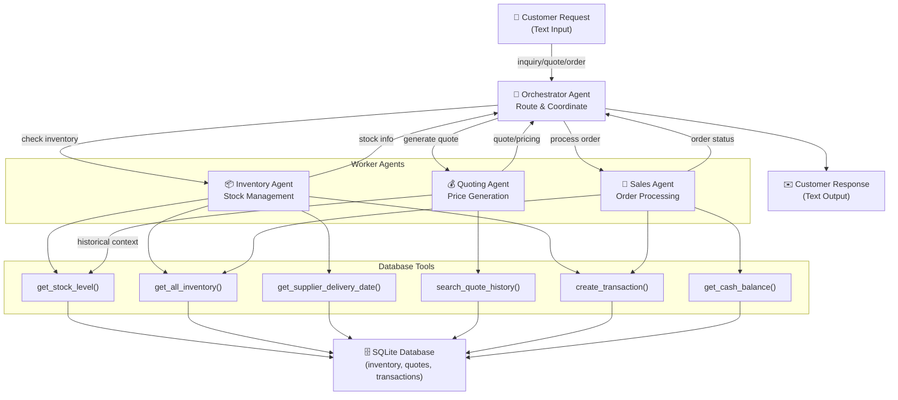

```mermaid
graph TB
    Customer["👤 Customer Request<br/>(Text Input)"]

    Orch["🎯 Orchestrator Agent<br/>Route & Coordinate"]

    subgraph Workers["Worker Agents"]
        Inv["📦 Inventory Agent<br/>Stock Management"]
        Quote["💰 Quoting Agent<br/>Price Generation"]
        Sales["🛒 Sales Agent<br/>Order Processing"]
    end

    subgraph Tools["Database Tools"]
        T1["get_stock_level()"]
        T2["get_all_inventory()"]
        T3["get_supplier_delivery_date()"]
        T4["search_quote_history()"]
        T5["create_transaction()"]
        T6["get_cash_balance()"]
    end

    DB["🗄️ SQLite Database<br/>(inventory, quotes, transactions)"]

    Response["✉️ Customer Response<br/>(Text Output)"]

    Customer -->|"inquiry/quote/order"| Orch
    Orch -->|"check inventory"| Inv
    Orch -->|"generate quote"| Quote
    Orch -->|"process order"| Sales

    Inv --> T1
    Inv --> T2
    Inv --> T3
    Inv --> T5

    Quote --> T4
    Quote -->|"historical context"| T1

    Sales --> T5
    Sales --> T6
    Sales --> T2

    T1 --> DB
    T2 --> DB
    T3 --> DB
    T4 --> DB
    T5 --> DB
    T6 --> DB

    Inv -->|"stock info"| Orch
    Quote -->|"quote/pricing"| Orch
    Sales -->|"order status"| Orch

    Orch --> Response
```
