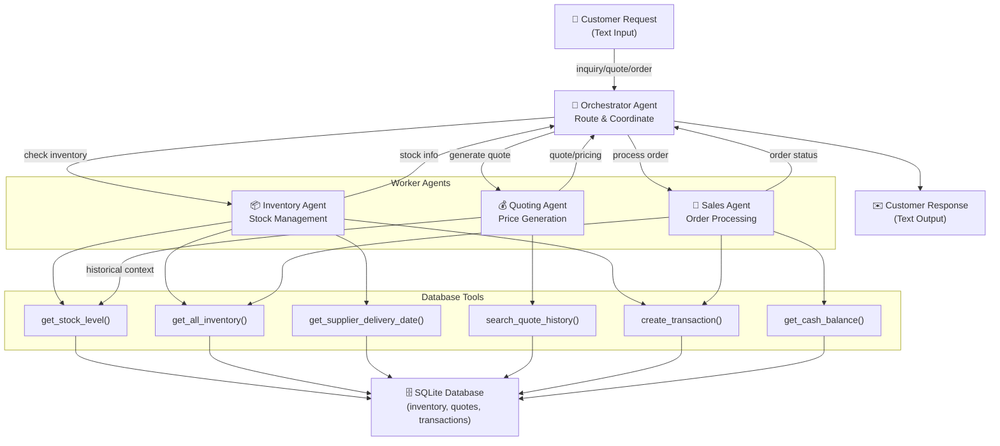
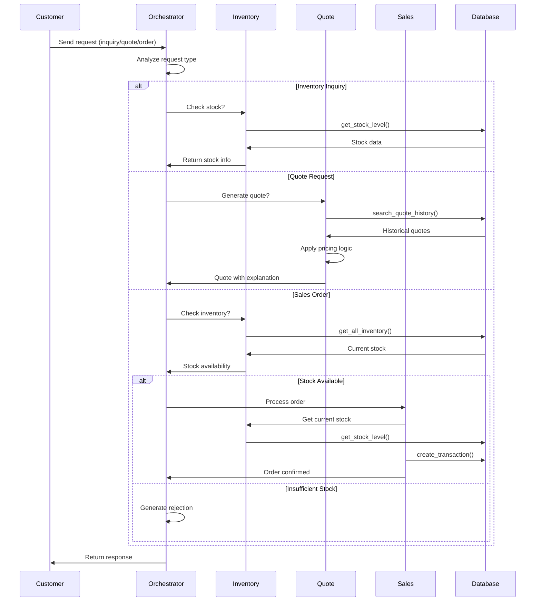

# Multi-Agent Architecture Design for Beaver's Choice Paper Company

## Executive Summary

This document captures the selected architecture for the multi-agent system: a Three-Agent Hub-and-Spoke pattern with one orchestrator and three worker agents. It is designed to stay within project constraints while keeping implementation straightforward and maintainable.

For alternatives that were considered, see [architecture_options.md](architecture_options.md).

### Key Constraints

- **Maximum 5 agents** - Strategic agent count to maintain simplicity
- **Text-based I/O** - All inputs and outputs are string-based
- **Database interaction** - Must use SQLite with provided helper functions
- **Use all 7 helper functions** - create_transaction, get_all_inventory, get_stock_level, get_supplier_delivery_date, get_cash_balance, generate_financial_report, search_quote_history

---

## Selected Architecture: Option 1 - Three-Agent Hub-and-Spoke

### Design Philosophy

A centralized orchestrator agent manages the flow between three specialized worker agents. This design is simple, maintainable, and meets all requirements efficiently.

### Agent Roles

| Agent                      | Count | Responsibility                                                  | Tools                                                                                              |
| -------------------------- | ----- | --------------------------------------------------------------- | -------------------------------------------------------------------------------------------------- |
| **Orchestrator Agent**     | 1     | Route requests, manage conversation state, coordinate responses | Route Analysis, Response Formatter                                                                 |
| **Inventory Agent**        | 1     | Monitor stock, assess reorder needs, check supplier timelines   | `get_all_inventory()`, `get_stock_level()`, `get_supplier_delivery_date()`, `create_transaction()` |
| **Quoting Agent**          | 1     | Generate quotes, apply discounts, leverage historical data      | `search_quote_history()`, Discount Calculator, Quote Engine                                        |
| **Sales Agent**            | 1     | Process orders, update inventory, finalize transactions         | `create_transaction()`, `get_all_inventory()`, `get_cash_balance()`                                |
| **Business Analyst Agent** | 1     | (Optional) Analyze performance, suggest improvements            | generate_financial_report()                                                                        |

**Total: 4 agents (1 under max of 5)**

### Data Flow Diagram



### Workflow Sequence



### Pros & Cons

**Pros:**

- ✅ Simple and clean architecture
- ✅ Easy to understand and debug
- ✅ Scalable - can add more specialized workers
- ✅ Clear separation of concerns
- ✅ Single point of coordination (orchestrator)
- ✅ All helper functions utilized

**Cons:**

- ⚠️ Orchestrator becomes a bottleneck for complex requests
- ⚠️ Less flexibility for parallel operations
- ⚠️ Inventory and Sales agents have overlapping database access

### Implementation Considerations

1. **Orchestrator Design Pattern:**
   - Use regex or NLP to classify request type
   - Maintain conversation context for multi-turn interactions
   - Format consistent response messages

2. **Tool Implementation:**
   - Wrapper functions for each database operation
   - Caching for frequently accessed data (optional)
   - Error handling with graceful fallbacks

3. **Integration Points:**
   - All agents share single database engine
   - Consistent date formatting (ISO 8601)
   - Transaction atomicity for order processing

---

## Why This Architecture

### Why This Choice?

1. **Optimal for Project Scope** - The exercise requirements fit naturally into 3 worker domains
2. **Clean Implementation** - Clear separation without unnecessary complexity
3. **All Requirements Met** - Easily incorporates all 7 helper functions
4. **Maintainability** - Easy to understand, debug, and extend
5. **Time Efficient** - Can be implemented quickly within 6-hour window
6. **Orchestrator Pattern** - Industry-standard approach for agent systems

### Helper Function Allocation

```text
Orchestrator Agent:
  └─ Routes requests based on type
  └─ Manages conversation state
  └─ Formats responses

Inventory Agent (Tools):
  ├─ get_all_inventory()      → Get full stock snapshot
  ├─ get_stock_level()        → Check specific item stock
  ├─ get_supplier_delivery_date() → Estimate reorder timing
  └─ create_transaction()     → Log reorder transactions

Quoting Agent (Tools):
  ├─ search_quote_history()   → Find relevant past quotes
  ├─ get_stock_level()        → Verify availability for quotes
  └─ Pricing Logic            → Apply discounts, calculate prices

Sales Agent (Tools):
  ├─ create_transaction()     → Record sales
  ├─ get_all_inventory()      → Check availability
  ├─ get_cash_balance()       → Track financial impact
  └─ get_stock_level()        → Verify exact quantities
```

**All 7 Helper Functions Utilized:** ✅

---

## Implementation Framework Recommendation

### Suggested Frameworks

1. **pydantic-ai** (Recommended)
   - Modern, type-safe agent framework
   - Excellent for structured tool definitions
   - Strong typing support for responses
2. **smolagents**
   - Simple and lightweight
   - Good for straightforward agent workflows
   - Lower overhead than pydantic-ai

3. **npcsh** (Less ideal)
   - More complex learning curve
   - Better for larger enterprise systems

---

## Next Steps

1. **Select Framework** - Recommend pydantic-ai or smolagents
2. **Define Tools** - Wrap helper functions for each agent
3. **Implement Agents** - Start with orchestrator, then workers
4. **Test Integration** - Use provided test dataset
5. **Evaluate Performance** - Against rubric criteria

---

## Risk Assessment & Mitigation

| Risk                                  | Likelihood | Mitigation                                          |
| ------------------------------------- | ---------- | --------------------------------------------------- |
| Database transaction conflicts        | Low        | Use transaction IDs, validate before update         |
| Orchestrator becomes bottleneck       | Low        | Agents can process in parallel                      |
| Complex conversation context          | Medium     | Implement state management structure                |
| Agent hallucination (wrong decisions) | Medium     | Strict tool signatures, validation before execution |
| Insufficient inventory scenarios      | Medium     | Clear fallback messages, reorder logic              |
