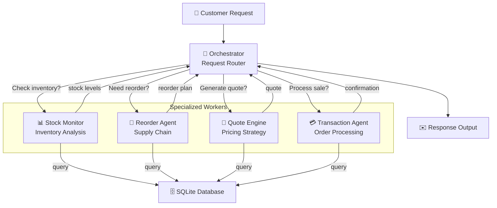
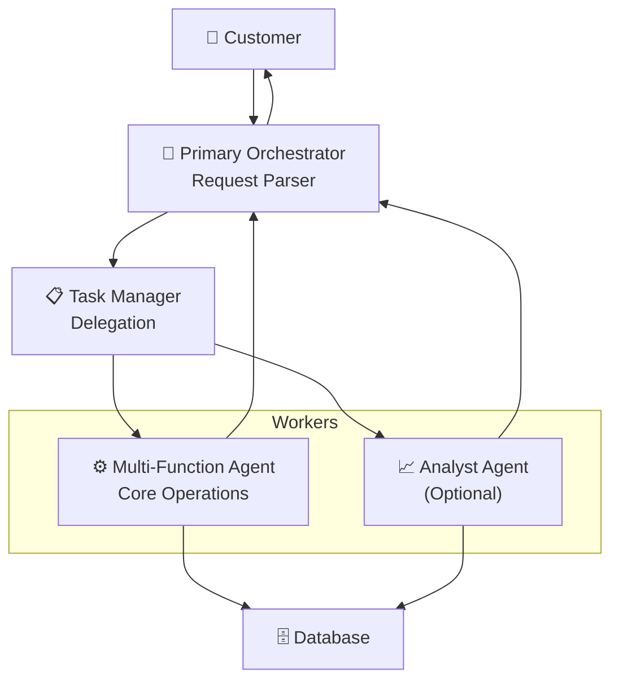

# Alternative Architecture Options

This document contains two alternative architectural approaches that were considered but not selected for this project. Option 1 (Three-Agent Hub-and-Spoke) was chosen as the recommended architecture. These alternatives are provided for reference and may be useful for future projects with different requirements.

---

## Architecture Option 2: Five-Agent Specialized (ADVANCED)

### Design Philosophy

Maximize specialization with five dedicated agents: each worker agent handles one specific function, plus an orchestrator. This provides maximum flexibility and parallelization potential.

### Agent Roles

| Agent                   | Responsibility                                                | Primary Tools                                          |
| ----------------------- | ------------------------------------------------------------- | ------------------------------------------------------ |
| **Orchestrator Agent**  | Request classification, task assignment, response composition | Classification, Router                                 |
| **Stock Monitor Agent** | Real-time inventory tracking, reorder triggering              | `get_all_inventory()`, `get_stock_level()`             |
| **Reorder Agent**       | Supply chain decisions, delivery estimation                   | `get_supplier_delivery_date()`, `create_transaction()` |
| **Quote Engine Agent**  | Pricing strategies, discount optimization                     | `search_quote_history()`, Pricing Logic                |
| **Transaction Agent**   | Sales processing, database transactions, financial tracking   | `create_transaction()`, `get_cash_balance()`           |

**Total: 5 agents (at max)**

### Architecture Diagram

### Pros & Cons

**Pros:**

- ✅ Maximum specialization and focus
- ✅ Agents can potentially work in parallel
- ✅ Easy to test individual components
- ✅ Reusable agents across different requests

**Cons:**

- ⚠️ More complex orchestration logic
- ⚠️ More database round trips (performance overhead)
- ⚠️ Harder to maintain conversation context
- ⚠️ Overkill for this project scope
- ⚠️ Difficult to handle interdependencies (e.g., quote needs stock info)

### Best For

Large-scale systems with massive request volume or complex agent workflows.

---

## Architecture Option 3: Two-Tier with Delegation (HYBRID)

### Design Philosophy

Primary orchestrator manages high-level workflow, delegates to a "task manager" agent which coordinates worker agents. Balances simplicity with flexibility.

### Agent Roles

| Agent                        | Responsibility                                           |
| ---------------------------- | -------------------------------------------------------- |
| **Primary Orchestrator**     | Initial request parsing, customer communication          |
| **Task Manager**             | Delegate tasks, manage inter-agent dependencies          |
| **Multi-function Worker**    | Handles inventory, quotes, and sales (3-in-1 efficiency) |
| **(Optional) Analyst Agent** | Business intelligence, recommendations                   |

**Total: 3-4 agents**

### Architecture Diagram

### Pros & Cons

**Pros:**

- ✅ Good balance between simplicity and functionality
- ✅ Task Manager provides clear delegation pattern
- ✅ Easier than 5-agent, simpler than 3-agent
- ✅ Multi-function agent consolidates common tasks

**Cons:**

- ⚠️ Task Manager adds a layer of indirection
- ⚠️ Less specialized than Option 2
- ⚠️ Multi-function agent becomes complex

---

## Comparison Matrix

| Aspect                | Option 1 (3-Agent) | Option 2 (5-Agent) | Option 3 (2-Tier) |
| --------------------- | ------------------ | ------------------ | ----------------- |
| **Simplicity**        | ⭐⭐⭐⭐⭐         | ⭐⭐               | ⭐⭐⭐⭐          |
| **Scalability**       | ⭐⭐⭐⭐           | ⭐⭐⭐⭐⭐         | ⭐⭐⭐            |
| **Specialization**    | ⭐⭐⭐             | ⭐⭐⭐⭐⭐         | ⭐⭐⭐            |
| **Maintainability**   | ⭐⭐⭐⭐⭐         | ⭐⭐               | ⭐⭐⭐            |
| **Development Time**  | 🟢 Fast            | 🟠 Slow            | 🟡 Medium         |
| **Agent Reusability** | ⭐⭐⭐             | ⭐⭐⭐⭐⭐         | ⭐⭐⭐⭐          |
